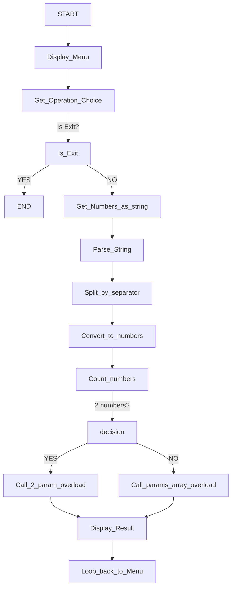

```mermaid
flowchart TD
    START --> Display_Menu
    Display_Menu --> Get_Operation_Choice
    Get_Operation_Choice -->|Is Exit?| Is_Exit
    Is_Exit -->|YES| END
    Is_Exit -->|NO| Get_Numbers_as_string
    Get_Numbers_as_string --> Parse_String
    Parse_String --> Split_by_separator
    Split_by_separator --> Convert_to_numbers
    Convert_to_numbers --> Count_numbers
    Count_numbers -->|2 numbers?| decision
    decision -->|YES| Call_2_param_overload
    decision -->|NO| Call_params_array_overload
    Call_2_param_overload --> Display_Result
    Call_params_array_overload --> Display_Result
    Display_Result --> Loop_back_to_Menu
```