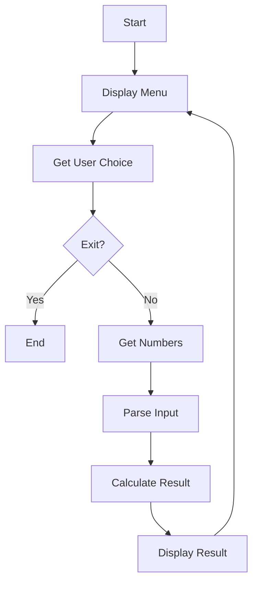

# Flowchart


```mermaid
flowchart TD
    Start --> Menu[Display Menu]
    Menu --> GetChoice[Get User Choice]
    GetChoice --> Exit{Exit?}
    Exit -->|Yes| End
    Exit -->|No| GetNumbers[Get Numbers]
    GetNumbers --> Parse[Parse Input]
    Parse --> Calculate[Calculate Result]
    Calculate --> Display[Display Result]
    Display --> Menu
```

## Operations

```
Add: sum all numbers
Subtract: subtract from first number
Multiply: multiply all numbers
Divide: divide first by others
```
